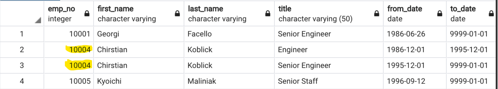
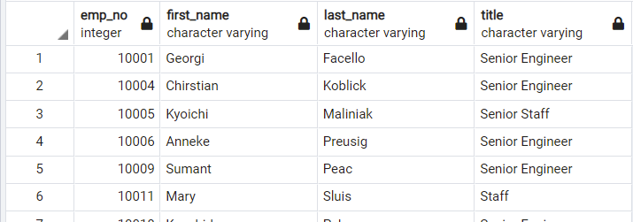

# Challenge 7 - Pewlett-Hackard Analysis
## Overview
The purpose of this analysis is to provide managers with information regarding upcoming retirees at Pewlett-Hackard so that they can plan for the future.
## Results
* A complete query of retirement age employees, with their name and most title was generated by filtering on the birthdate range `BETWEEN '1952-01-01' AND '1955-12-31'`. However, because some employees held multiple titles during their tenure, this `JOIN` method caused some employees to show up multiple times, which would lead to an inaccurate count.

    

* In order to account for duplicates, the rows were sorted by `to_date` and the first of each unique `emp_no` was selected for export.  This ensures that older titles were removed from the list. Below is an example of the table. The full .csv can be downloaded [here](./Data/unique_titles.csv).

    

* The above table was then grouped by title, and each unique `emp_no` was counted for each title, to get the final result. The full .csv can be downloaded [here](./Data/retiring_titles.csv).

    

* A separate query written to retrieve all employees who are eligibile for the mentorship program. This includes all current employees who were born between January 1, 1965 and December 31, 1965.  The full .csv can be downloaded [here](./Data/mentorship_eligibility.csv).

## Summary
* As the "silver tsunami" approaches, a total of **90398** employees will be eligible for retirement.  This can by found by querying the above `unique_titles.csv` table using the following SQL statement:
    ``` SQL
    SELECT COUNT (emp_no) FROM unique_titles; 
    ```
    
* Are there enough qualified, retirement-ready employees to provide mentorship for the younger generation? The `COUNT` of employees in the `mentorship_elegibility.csv` referenced above is **1549**. To find the number of employees that may need mentorship, we can find the count of employees younger than 35 years old (with respect to the apparent age of the data -- year 2000 -- this appears to be the "young" generation) using the following query:
    ``` SQL
    SELECT COUNT (emp_no) FROM employees WHERE (birth_date > '1965-01-01');
    ```
    The result of this query is **1879** "young" employees at Pewlett-Hackard.  Compared to the **1549** eligible mentors, this means the ratio of mentors to young employees is roughly **1:1.2**, which means that only a few employees will have to share a mentor. 
